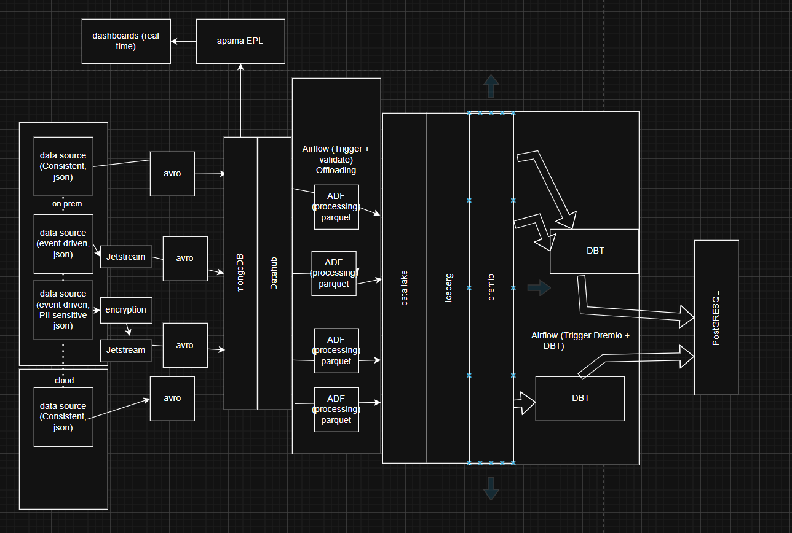

# a project to understand data engineering practices and tools with IoT platform

#  Data Schema
1. Facial Recognition
1.1 AIcamera
 - Time
 - Email
 - DeviceId
1.2 Facial Access System
 - Time
 - Email
 - DeviceId
2. BMS
2.1 Air-Conditioning
 - Temperature
 - Humidity
 - Voltage
 - Temperature Setpoints
 - Humidity Setpoints
2.2 Mechnical Ventiliation
 - Fan Speed
 - Fan Speed Setpoint
2.3 Power Meter
 - Kwh
2.4 Lighting
 - Voltage
 - Brightness (lux)
 - Brightess Setpoints
2.5 Water Meter
 - flow rate
3. In-Door Air Quality Sensors
 - Temperature
 - Humidity
 - Brightness
4. Oura Ring
 - heartrate
 - stress level
 - steps count
5. Network Log
 - mac-address
 - gateway IP address
 - Email

 #  Data Size
1. Facial Recognition
1.1 AIcamera - Event Driven. 300 camera. average 1 event every 10 seconds. 1% camera ~1 event every 0.1 seconds.
1.2 Facial Access System - Event Driven. 150 FAS. average 1 event 20 seconds. 1% FAS ~1 event every 5 seconds.
2. BMS
2.1 Air-Conditioning - 200 units. interval based. 3 data points per minute constant.
2.2 Mechnical Ventiliation - 30 units. interval based. 3 data points per minute constant.
2.3 Power Meter - 800 units - interval based. 3 data points per minute constant.
2.4 Lighting - 200 units - interval based. 3 data points per minute constant.
2.5 Water Meter - 150 units - interval based. 3 data points per hour constant.
3. In-Door Air Quality Sensors - 100 units - interval based. 1 data points per 5 minute constant.
4. Oura Ring - 100 units - Event Driven. ~20 data points per minute.
5. Network Log - 200 units - interval based. 1 data points per 1 minute constant.

average per day ~11M data

# Data premise
1. Facial Recognition
1.1 AIcamera - on-premise
1.2 Facial Access System - on-premise
2. BMS
2.1 Air-Conditioning - on-premise
2.2 Mechnical Ventiliation - on-premise
2.3 Power Meter - on-premise
2.4 Lighting - on-premise
2.5 Water Meter - on-premise
3. In-Door Air Quality Sensors - cloud
4. Oura Ring - cloud
5. Network Log - on-premise

In scope
- ocastrating tools - Airflow
- database NoSQL - MongoDB
- database datalake (offloading) 
- data batch processing tools (Pyspark)
- database SQL - PostgreSQL
Out Scope
- OCPUA Framework
- BACnet Framework
- Kubernetes
- Distributed logging
- Data Discovery tool
- Data versioning (DBT)
- data streaming processing tools (Kafka) 

# design archetecture
https://drive.google.com/file/d/1dG8Gm3lg0wPA1y5sJRg1jnPK7XwFxFMb/view?usp=sharing

